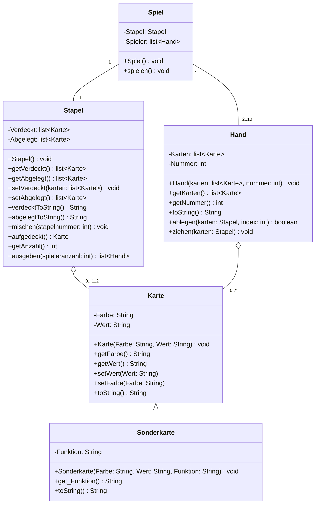

# Projektarbeit: UNO-Kartenspiel

Objektorientierte Umsetzung des Kartenspiels UNO in Python.
Dieses Dokument ist die vollständige, ausführbare Aufgabenstellung. Alle inhaltlichen Vorgaben der Originalaufgabe sind übernommen; die organisatorische Aufteilung auf Teammitglieder wurde entfernt und durch Arbeitspakete ersetzt.

---

## 1. Projektüberblick

| Punkt | Vorgabe |
|---|---|
| Sprache | Python |
| Paradigma | Objektorientierte Programmierung (Klassen, Vererbung, Kapselung) |
| Projektordner | `Kartenspiel` |
| Einstiegsdatei Phase 1 | `karte.py` |
| Ziel | Ein lauffähiges UNO-Spiel für 2–10 Spieler auf der Konsole |

### Empfohlene Dateistruktur

```
Kartenspiel/
├── karte.py          # Klasse Karte
├── sonderkarte.py    # Klasse Sonderkarte (erbt von Karte)
├── stapel.py         # Klasse Stapel
├── hand.py           # Klasse Hand
└── spiel.py          # Klasse Spiel (Einstiegspunkt, spielen())
```

Die benötigten Klassen sind in den jeweiligen Dateien korrekt zu importieren.

---

## 2. Phase 1 — Grundgerüst der Klasse `Karte`

### Aufgabe a)

Implementiere das Grundgerüst der Klasse `KARTE` und speichere die Datei im Ordner `Kartenspiel` unter dem Dateinamen `karte.py`.

**Vorgegebenes UML:**

```
┌──────────────────────────────────────────┐
│                  Karte                   │
├──────────────────────────────────────────┤
│ -Farbe: String                           │
│ -Wert: String                            │
├──────────────────────────────────────────┤
│ +Karte(Farbe:String, Wert:String): void  │
│ +getFarbe(): String                      │
│ +getWert(): String                       │
│ +setWert(Wert:String)                    │
│ +setFarbe(Farbe:String)                  │
│ +toString(): String                      │
└──────────────────────────────────────────┘
```

| Element | Sichtbarkeit | Typ / Signatur |
|---|---|---|
| `Farbe` | privat | String |
| `Wert` | privat | String |
| Konstruktor | öffentlich | `Karte(Farbe: String, Wert: String) -> void` |
| `getFarbe()` | öffentlich | `-> String` |
| `getWert()` | öffentlich | `-> String` |
| `setFarbe(Farbe: String)` | öffentlich | — |
| `setWert(Wert: String)` | öffentlich | — |
| `toString()` | öffentlich | `-> String` |

### Aufgabe b)

Erzeuge die folgenden beiden UNO-Karten als Objekt und lass sie dir unter Verwendung der `__str__()`-Methode ausgeben:

- `blau, 0`
- `rot, 6`

**Abnahmekriterium:** Beide Objekte lassen sich per `print(objekt)` ausgeben; die Ausgabe erfolgt über `__str__()` bzw. `toString()`.

---

## 3. Phase 2 — Spielregeln und Klassenmodellierung

Die Klasse `KARTE` wird für das Spiel UNO erweitert. Dafür ist zunächst zu klären, welche Klassen von Objekten in UNO existieren. Es existieren verschiedene Möglichkeiten der Klassenmodellierung.

### 3.1 Kartenverteilung (112 Karten)

Grundlage der Modellierung ist die Spielanleitung von UNO. Die dort aufgeführten 112 Karten teilen sich wie folgt auf:

- je 19 Karten der Farbe **blau, rot, grün, gelb**
- pro Farbe existiert eine Karte mit der Ziffer **0** und je **zwei** Karten mit den Ziffern **1 bis 9**
- jeweils **6 Sonderkarten** jeder Farbe
- **4 Joker-Karten**
- **4 Vier-Ziehen-Joker-Karten**
- ein **Handkarten-Misch-Joker** und **3 Joker zur freien Gestaltung**

> Hinweis aus der Aufgabenstellung: Wie viele dieser Spezialkarten umgesetzt werden, hängt von den Programmierkenntnissen und der Zusammenarbeit ab. Die Sonderregeln dürfen zunächst vernachlässigt werden (siehe Arbeitspaket `Spiel`).

### 3.2 Offizielle Spielregeln (Grundlage der Modellierung)

**Rahmendaten:** ab 7 Jahren, 2–10 Spieler.
**Inhalt:** 112 Karten – einschließlich 3 individueller Joker.

**Ziel des Spiels**
Jeder Spieler versucht, als Erster seine Handkarten loszuwerden.

**Spielvorbereitung**
1. Die Karten werden gemischt.
2. Jeder Spieler erhält 7 Karten.
3. Die restlichen Karten werden **verdeckt** in die Tischmitte gelegt. Das ist der **Nachziehstapel**.
4. Die oberste Karte des Nachziehstapels wird aufgedeckt und **offen** danebengelegt: Das ist die erste Karte des **Ablagestapels**. Falls es sich um eine Sonderkarte handelt, wird sie nicht berücksichtigt und eine weitere Karte aufgedeckt.
5. Der linke Nachbar des Kartengebers beginnt, danach wird reihum im Uhrzeigersinn gespielt.

**Spielablauf**
Wer an der Reihe ist, versucht seine Handkarten loszuwerden, indem er **eine** Karte auf den Ablagestapel legt.

*Falls der Spieler eine passende Karte auf der Hand hat, kann er sie auf den Ablagestapel legen:*
1. Damit die Karte passt und der Spieler sie legen darf, muss **mindestens ein Element** mit der obersten Karte des Ablagestapels übereinstimmen: **Farbe, Zahl oder Symbol**.
2. Handelt es sich bei der gespielten Karte um eine Sonderkarte, passiert etwas Besonderes.

*Falls der Spieler keine passende Karte hat, zieht er eine Karte vom Nachziehstapel:*
1. Passt die neue Karte, darf der Spieler sie legen.
2. Auch wenn der Spieler eine passende Karte hat, darf er entscheiden, sie nicht zu legen und stattdessen eine Karte zu ziehen.

Nachdem der Spieler eine Karte gelegt oder gezogen hat, ist der nächste Spieler an der Reihe.

**Hinweis:** Ist der Nachziehstapel aufgebraucht, werden die Karten des Ablagestapels gemischt und bilden den neuen Nachziehstapel.

**„UNO!" rufen**
Sobald ein Spieler nur noch eine einzige Karte auf der Hand hat, muss er „UNO!" rufen, damit die Mitspieler wissen, dass er bald gewinnen könnte. Merkt jemand, dass ein Spieler nur noch eine einzige Karte hat, aber nicht „UNO!" gerufen hat, bevor der nächste Spieler seinen Zug beginnt, muss der Spieler als Strafe 2 Karten ziehen.

**Gewinnen**
Sobald ein Spieler seine letzte Karte legt, hat er gewonnen. Dann werden die Karten neu gemischt, und die nächste Runde beginnt.

### 3.3 Teilaufgabe

**Aufgabe:** Welche möglichen Klassen findest du in der UNO-Spielanleitung?
→ Ergebnis dokumentieren (Klassenkandidaten mit Attributen und Verantwortlichkeiten), bevor mit der Implementierung begonnen wird.

---

## 4. Vorgeschlagenes UML-Klassendiagramm

Das folgende Modell ist ein **Vorschlag**. Es wurde bewusst vereinfacht, um ein umsetzbares Konstrukt zu gewährleisten. Änderungen sind ausdrücklich erlaubt.



**Beziehungen im Detail**

| Beziehung | Multiplizität | Art |
|---|---|---|
| `Stapel` ↔ `Karte` | 1 Stapel enthält 0…112 Karten | Aggregation |
| `Hand` ↔ `Karte` | 1 Hand enthält 0..* Karten; 1 Karte gehört zu 0..1 Hand | Aggregation |
| `Spiel` ↔ `Stapel` | 1 : 1 | Assoziation |
| `Spiel` ↔ `Hand` | 1 Spiel : 2..10 Hände | Assoziation |
| `Karte` ↔ `Sonderkarte` | — | Vererbung (`Sonderkarte` erbt von `Karte`) |

---

## 5. Phase 3 — Arbeitspakete (Implementierung)

Die vier Arbeitspakete sind unabhängig voneinander implementierbar und anschließend zu integrieren.

### AP 1 — Klasse `HAND`

Implementiere die Klasse `HAND` inklusive Konstruktor, der *getter*- und *setter*-Methoden sowie der `toString()`-Methode. Importiere die benötigten Klassen korrekt.

**`toString()`**
- liefert einen **mehrzeiligen** Text (Zeilenumbrüche `\n` einfügen)
- zu Beginn wird die **Spielernummer** hinzugefügt
- anschließend wird **pro Zeile eine Karte** im Format `index: farbe wert` inkludiert

Beispielausgabe:

```
Spieler 1
0: grün 0
1: grün 1
2: rot 6
3: grün 7
4: rot 3
5: blau 9
6: rot 5
```

**Zusätzliche Methoden**
- `ziehen(stapel)` — zieht eine Karte vom verdeckten Stapel auf die Hand
- `ablegen(stapel, index)` — legt die Karte mit dem angegebenen Index auf den Ablagestapel; Rückgabetyp laut UML: `boolean`

---

### AP 2 — Klasse `STAPEL`

Implementiere die Klasse `STAPEL` **vollständig**. Hinweise zu den einzelnen Methoden:

| Methode | Vorgabe |
|---|---|
| `verdecktToString()` | Liefert einen String, der mit der Zeile `verdeckt:` beginnt. Jede Karte wird als einzelne Zeile hinzugefügt; Zeilenumbrüche korrekt einfügen. |
| `abgelegtToString()` | Liefert einen String, der mit der Zeile `abgelegt:` beginnt. Jede Karte wird als einzelne Zeile hinzugefügt; Zeilenumbrüche korrekt einfügen. |
| `mischen(stapelnummer)` | Für Nummer `0` wird der **verdeckte** Stapel gemischt, andernfalls der **abgelegte** Stapel. Zum Mischen ist eine geeignete Funktion des Datentyps Liste zu nutzen. |
| `aufgedeckt()` | Liefert die aktuell aufgedeckte (oberste) Karte des Ablagestapels. |
| `getAnzahl()` | Liefert die Anzahl der Karten als `int`. |
| `ausgeben(spieleranzahl)` | Verteilt die Karten und liefert eine `list<Hand>` zurück. |

Ebenfalls umzusetzen: Konstruktor `Stapel()`, `getVerdeckt()`, `getAbgelegt()`, `setVerdeckt(karten)`, `setAbgelegt()`.

Beispielstruktur der Ausgabe:

```
verdeckt:
blau 0
rot 6
...
```

---

### AP 3 — Klasse `SONDERKARTE`

Implementiere die Klasse `SONDERKARTE` als Unterklasse von `Karte` so, dass:

- das Attribut `wert` mit der **Anzahl der zu ziehenden Karten** belegt werden kann,
- für Karten zum **Richtungswechsel** bzw. zum **Aussetzen** beim Erstellen `None` übergeben wird,
- die `toString()`-Methode **überschrieben** wird, sodass die **Funktion** der Sonderkarte mit ausgegeben wird.

**Signatur laut UML**

```
Sonderkarte(Farbe: String, Wert: String, Funktion: String) -> void
get_Funktion() -> String
toString() -> String
```

**Testcase:** Erstelle die Karten `blau 2 ziehen` und `rot Aussetzen` und lass sie dir ausgeben.

---

### AP 4 — Klasse `SPIEL`

Implementiere die Klasse `SPIEL`. Die Funktion `spielen()` soll ein **komplettes UNO-Spiel** realisieren. Alle Sonderregeln können dabei vorerst vernachlässigt werden.

Vorgaben:

- Der Spieler gibt die **Anzahl der Spieler** ein.
- Für jeden Spieler werden die **aufgedeckte Karte** und **seine Hand** ausgegeben.
- Der Spieler gibt anschließend ein, **ob er legen kann oder nicht**. Falls ja, wird der **Index** der abzulegenden Karte erfragt. Das Programm muss überprüfen, ob die Karte tatsächlich abgelegt werden darf.
- Hat der Spieler nach dem Legen nur noch **eine Karte**, wird `UNO` ausgegeben.
- Hat der Spieler **keine Karte** mehr, wird ausgegeben, **welchen Platz** er belegt hat.
- Sollte der Stapel mit verdeckten Karten **leer** sein, wird die aufgedeckte Karte vom abgelegten Stapel entnommen und bildet den neuen abgelegten Stapel. Die anderen Karten werden gemischt und als neuer verdeckter Stapel verwendet.

---

## 6. Phase 4 — Integration zum lauffähigen Spiel

Die fehlenden Bestandteile einfügen, damit ein vollständiges Spiel möglich ist, z. B.:

- Karten aus der Hand in den Stapel überführen
- Auswahl der abzulegenden Karte
- Überprüfung der Korrektheit (passt Farbe, Zahl oder Symbol?)
- …

---

## 7. Zusatzaufgabe — Echte Mischtechniken implementieren

Biete vor Spielbeginn den Nutzenden die Auswahl eines beliebigen Verfahrens zur Stapelmischung an, z. B.:

- Overhand Shuffle
- Riffle Shuffle
- Mischen über verschiedene Kartenhäufchen
- …

---

## 8. Abnahmekriterien (Checkliste)

- [ ] `karte.py` im Ordner `Kartenspiel` mit vollständiger Klasse `Karte` (Attribute privat, getter/setter, `toString()`/`__str__()`)
- [ ] Testausgabe der Karten `blau 0` und `rot 6` über `__str__()`
- [ ] Klassenkandidaten aus der Spielanleitung dokumentiert
- [ ] Klasse `Stapel` vollständig; `verdecktToString()` beginnt mit `verdeckt:`, `abgelegtToString()` mit `abgelegt:`
- [ ] `mischen(0)` mischt den verdeckten, `mischen(≠0)` den abgelegten Stapel (Listenfunktion)
- [ ] Klasse `Hand` mit mehrzeiligem `toString()` im Format `Spieler n` + `index: farbe wert`
- [ ] `ziehen(stapel)` und `ablegen(stapel, index)` funktionsfähig
- [ ] Klasse `Sonderkarte` erbt von `Karte`, `wert` = Anzahl zu ziehender Karten, `None` für Richtungswechsel/Aussetzen
- [ ] Testcase `blau 2 ziehen` und `rot Aussetzen` erzeugt und ausgegeben
- [ ] `Spiel.spielen()` führt ein vollständiges Spiel durch (Spielerzahl-Eingabe, Ausgabe, Legeprüfung, `UNO`-Ausgabe, Platzierung, Stapel-Recycling)
- [ ] Nachziehstapel-Recycling bei leerem verdecktem Stapel korrekt umgesetzt
- [ ] (optional) Auswahl echter Mischtechniken vor Spielbeginn
